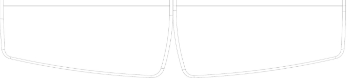

# Kinesis Gaming RGB Split Keyboard
 
My kinesis gaming rgb keyboard settings.

- [Prof 1](https://github.com/nikilok/KinesisGamingKeyboard/blob/master/layouts/layout1.txt) - Final Fantasy 14
- [Prof 2](https://github.com/nikilok/KinesisGamingKeyboard/blob/master/layouts/layout2.txt) - VS Code IDE
- [Prof 3](https://github.com/nikilok/KinesisGamingKeyboard/blob/master/layouts/layout3.txt) - Brawlhalla Gun Macros
- [Prof 4](https://github.com/nikilok/KinesisGamingKeyboard/blob/master/layouts/layout4.txt) - Brawlhalla Kaya Macros

**KB975 Direct Programming Guide **

` `1 

Keyboard models covered by this manual:  

   KB975-BLU 

   KB975-RED 

   KB975-BRN 

   KB975-SIL 

Version: Expansion Pack 2 (September 23, 2020) 

Kinesis Corporation 22030 20th  Avenue SE, Suite 102  Bothell, Washington 98021 USA www.KinesisGaming.com 

` `2 

This manual covers features included through firmware version 1.0.121 and Lighting Expansion Pack unless otherwise indicated. To download the latest firmware and to access all support resources visit: 

https://gaming.kinesis-ergo.com/fs-edge-rgb-support/ 

To shop for accessories visit: 

   Lift Kit- Adjustable tenting accessory (5°/10°/15°) for use with Palm Supports  

   V3 Pro- Adjustable tenting accessory (5°/10°/15°) for use without Palm Supports 

   XL Mouse Pad- Oversized Desk Mat/Mousepad designed for use with the Freestyle Edge    Mac Keycaps- 4 shine-through keycaps for the standard Mac modifiers  

   Vektor– RGB Gaming Mouse (Dual-Zone RGB Lighting, 6 Programmable Buttons) 

KinesisGaming.com/shop 

© 2020 by Kinesis Corporation, all rights reserved. Kinesis and Freestyle are registered trademarks of Kinesis Corporation.  Freestyle Edge, SmartSet, and v-Drive are trademarks of Kinesis Corporation. All other trademarks are property of their respective owners. Information in this document is subject to change without notice. No part of this document may be reproduced 

or transmitted in any form or by any means, electronic or mechanical, for any commercial purpose, without the express written permission of Kinesis Corporation. ****

**FCC Radio Frequency Interference Statement** 

This equipment has been tested and found to comply with the limits for a Class B digital device, pursuant to Part 15 of the FCC Rules. These limits are designed to provide reasonable protection against harmful interference when the equipment is operated in a residential installation. This equipment generates, uses, and can radiate radio frequency energy and, if not installed and used in accordance with the instructions, may cause harmful interference to radio communications. However, there is no guarantee that interference will not occur in a particular installation. If this equipment does cause harmful interference to radio or television reception, which can be determined by turning the equipment off and on, the user is encouraged to try to correct the interference by one or more of the following measures: 

   Reorient or relocate the receiving antenna 

   Increase the separation between the equipment and receiver 

   Connect the equipment into an outlet on a circuit different from that to which the receiver is connected    Consult the dealer or an experienced radio/TV technician for help 

**Warning** 

To assure continued FCC compliance, the user must use only shielded interfacing cables when connecting to computer or peripheral. Also, any unauthorized changes or modifications to this equipment would void the user’s authority to operate.** 

**INDUSTRY CANADA COMPLIANCE STATEMENT** 

This Class B digital apparatus meets all requirements of the Canadian Interface-causing Equipment Regulations. 

Cet Appareil numerique de la classe B respecte toutes les exiginces du Reglement sur le material broilleur du Canada. 

**1.0 Introduction** 

The Freestyle Edge RGB is a fully-programmable keyboard that features 4MB of onboard flash storage (the “v-Drive) and does not use any special drivers or software. The keyboard was designed to be programmed quickly and easily using the onboard shortcuts or via the SmartSet App for Windows and Mac. Power users have the option to bypass the SmartSet GUI and “Direct Program” the keyboard on all major operating systems by accessing the keyboard’s simple text files configuration files.

**2.0 Direct Programming Overview** 

The Freestyle Edge RGB has 9 customizable Profiles which comprise 9 sets of layouts and lighting configurations. The keyboard also has a series of Global Keyboard Settings which can be configured. Each of these configurations are stored in a set of folders on the keyboard the “v-Drive”) as a series of simple text files (.txt). During onboard programming the keyboard automatically reads/writes to these files “behind the scenes”. The unique thing about the Edge is that power users can “connect” (aka “mount”) the v-Drive to their PC and then directly edit these configuration files in Windows, Linux, Mac, and Chrome. 

Each time a remap or macro is created in a Profile, it is written to the corresponding layout.txt file as a discrete line of “code”. Each time a Lighting Effect is modified in a Profile, the Effect and its specified “Parameters” are written to the corresponding led.txt file. Each time a keyboard setting is changed, the change is recorded in the “kbd\_settings.txt” file.**  

0. **Before you Begin **
0. **Power Users ONLY** 

Direct editing requires learning to read and write a custom syntax. The insertion of incorrect characters into any of the configuration files can have unintended consequences and could cause temporary problems with even basic keyboard operation. Read the Quick Start Guide and User Manual first and proceed with caution. 

2. **Always Eject the v-Drive before disconnecting the v-Drive  **

The v-Drive is just like any other flash drive you connect to your PC. If you remove it suddenly  while the PC is still accessing the drive contents you can cause file damage. To protect the v- Drive, always save and close all configuration files, and then use the appropriate eject protocol  for your operating system *before “*disconnecting” the v-Drive with the onboard shortcut. If your  PC refuses to eject the drive, ensure all files and folders are closed and try again.  

Windows Eject: Save and close any .txt files you have been editing. From File Explorer, navigate back to the top level of “FS EDGE RGB” removable drive and  right click the drive name and then select Eject. Once you receive the “Safe to  Eject” notification you may proceed to closing the v-Drive with the onboard  shortcut. Failure to eject can result in a minor drive error that Windows will ask  you to repair. The “Scan and Repair” process (shown at right) is quick and easy.  

3. **Non-US Users** 

Your computer must be configured for the English (US) keyboard layout. Other language drivers use different codes/positions for certain keys which are critical for programming characters such as [], {} and >. 

4. **Simple Text Files ONLY** 

Do not save configuration files in the Rich Text Format (.rft) as special characters can cause syntax errors. 

5. **Firmware update may be required** 

Some of the features described in this guide may require a firmware update. Download firmware and get installation instructions here: https://gaming.kinesis-ergo.com/fs-edge-rgb-support/#firmware. 

0. **Direct Programming Layouts  **

The Edge features 9 configurable Profiles, each with its own corresponding  “layout” (1-9). The nine default layouts are saved as separate .txt files in the  “layouts” subfolder on the v-Drive. Only custom remaps and macros are saved  to the file, so if no changes have been made to a layout, the file will be empty  and the keyboard performs “default” actions. Users can either write code from  scratch or edit existing code using the syntax rules described below. *Note:  Deleting a layout file will permanently delete its stored remaps & macros, but  the keyboard will automatically regenerate a blank layout file.*  

1. **File Naming Convention**  

Only the nine numbered layouts can be loaded to the Freestyle Edge RGB.  Additional “backup” layouts can be saved as .txt files with descriptive names,  but they cannot be loaded to the keyboard without renaming them first.  

2. **Syntax Overview– Position & Action Tokens** 

Remaps and macros are encoded in a layout file using a proprietary syntax. Each of the 95 full-size keys on the keyboard has been assigned a unique “Position” token used to identify that key for programming in either layer (see Position Token Map in Section 4.5).  

Each keyboard & mouse action supported by the Edge has been assigned a unique “Action” token corresponding to a standard USB “scan code”. (see Action Token Dictionary in Section 4.9). 

To successfully re-program a key, the user must use the syntax to designate the physical key (via a Position Token) and assign one or more key actions (via Action Tokens). The “>“ symbol is used to separate Position Tokens from Actions Tokens. Each individual token is surrounded by brackets. Examples: 

   Remaps are encoded with Square Brackets: [position]>[action] 

   Macros are encoded with Curly Brackets: {trigger key position}{modifier co-trigger}>{action1}{action2}... 

3. **Layout Programming Tips** 

   If the keyboard cannot understand the desired remap, then the default action will remain in effect. 

   Do not mix and match square and curly brackets in a single line of code 

   Separate each line of code with Enter/Return 

   The order in which the lines of code appears in the .txt file does not generally matter, except in the event 

of conflicting commands, in which case the command closest to the bottom of the file will be implemented. 

   Tokens are not case-sensitive. Capitalizing a token will not produce the “shifted” action. 

   A line of code can be temporarily disabled by placing an asterisk (\*) at the beginning of the line.** 

4. **Position Tokens** 

Generally speaking, position tokens are defined by the basic QWERTY Windows action for the key in the default layout. In some cases tokens have been modified for clarity and/or ease of programming. Each physical key has two tokens, one for the top layer action and one for virtual embedded layer action. To designate a key position in the Fn layer, you simply encode the prefix “fn“ (with a space) before the basic, top- layer token, and outside of the brackets.  

   *Example: The embedded Hotkey 1 position is:    fn [hk1]>...* 

However, there are 8 keys which have wholly unique Fn layer token which corresponds to the embedded layer action for that key position (see red tokens on the Position Token Map in Section 4.5).  

6. **Programming Remaps** 

To program a remap, encode the position token and one action token in square brackets, separated by “>“. **Remap Examples:** 

1. *Hotkey 1 performs Q:  [hk1]>[q]* 
1. *Escape key performs Caps Lock:  [esc]>[caps]* 
1. *The Left Windows key in the Fn layer performs Right Shift:  fn [lwin]>[rshft]* 

**Programming the Fn Key:** The Edge RGB supports two different types of Fn layer access: “Shift” (hold) and “Toggle” (tap). The default behavior of the Fn key is now “Shift”. *Note: It is necessary to assign the desired Fn Action Token to the Position Token in both layers, otherwise you’ll get stuck in the Fn layer.* 

**Shifted Actions:** Shifted characters (e.g., “!”) cannot be produced by a Remap. To produce a shifted key action, it is necessary to encode it as macro which includes both the down and up stroke of the shift key surrounding the basic key action.  Downstrokes are indicated by placing a “-” inside the bracket and upstrokes are indicated by placing “+”. See example macro 1 below.** 

7. **Programming Macros** 

To program a macro, encode the Position Token(s) to the left of the “>” in curly brackets. Then encode one or more Action Tokens to the right of the “>” in curly brackets. Each macro can include approximately 300 Action tokens and each layout can store up to 7,200 total macro tokens spread across up to 100 macros. 

**Trigger Keys:** Any non-modifier key in either layer can be trigger a macro. A co-trigger can be added by encoding a modifier to the left of “>”. See example 1 below. *Note: Windows co-triggers are not recommended.***  

**Individual Playback Speed Prefix {s\_}:** By default, all macros play at the selected “Global” playback speed. To assign a custom speed for improved playback performance for a given macro you can use the “Individual Playback Speed” prefix “{s\_}”. Choose a number from 1-9 corresponding to the speed scale shown Section 4.6. The speed prefix should be placed to the right of the “>“ before the macro content. See example 2 below. 

**Multiplay Prefix {x\_}:** By default, all macros playback continuously while the trigger key is held. To override the repeat feature and restrict a macro to playback a specific number of times you can use the “Macro Multiplay” prefix “{x\_}”. Choose a number from 1-9 corresponding to the number of times you want the macro to replay. The multiplay prefix should be placed to the right of the “>“ before the macro content. See example 3 below. If a macro is not playing back properly, try assigning a Multiplay value of 1. The macro may actually be firing multiple times before you are releasing the trigger key.  See example 3 below 

**Timing Delays:** Delays can be inserted into a macro to improve playback performance or to produce a mouse double-click. Delays are available in any interval between 1 and 999 millisecond ({d001} & {d999}), including random delays ({dran}). Delay tokens can be combined to produce delays of various durations and inserted at any point in a macro. See example 4 below. 

**Macro Examples:**  

1. Pause key performs “Hi” with a capital H:  {pause}{rctrl}>{-lshft}{h}{+lshft}{i} 
1. Hotkey 5 + Left Ctrl performs  “qwerty” at speed 9:  {lctrl}{hk5}>{s9}{q}{w}{e}{r}{t}{y} 
1. Hotkey 1 increases the volume 3 notches:  {hk1}>{x3}{vol+) 
1. Embedded Tab key performs one left-mouse double click:  fn {tab}>{x1}{lmous}{d125}{lmous} 
8. **Tap and Hold Actions** (\*Firmware update required).** 

With Tap and Hold, you can assign two unique actions to a single key based on the duration of the keypress. Each Layout can support up to 10 Tap and Hold actions. Designate the Position Token, then the Tap action, then the timing delay from 1 to 999 milliseconds using the special Tap and Hold token ({t&hxxx}), then the Hold Action. Due to inherent timing delays, Tap-and-Hold is not recommended for use with alphanumeric typing keys. Not all key actions support Tap-and-Hold. 

*Note: For most applications, we recommend a timing delay of 250ms.* 

**Tap and Hold Example:** 

*1.  Caps performs Caps when tapped and Esc when held longer than 500ms:   [caps]>[caps][t&h500][esc]* 

9. **Action Token Dictionary** (\*Firmware update may be required)** 

|A |B |C |D |E |F |G |H |I |J |K |L |
| - | - | - | - | - | - | - | - | - | - | - | - |
|M |N |O |P |Q |R |S |T |U |V |W |X |
|Y |Z |1 |2 |3 |4 |5 |6 |7 |8 |9 |0 |
|HYPH  |= |||||||||||
|F1 |F2 |F3 |F4 |F5 |F6 |F7 |F8 |F9 |F10 |F11 |F12 |
|F13 |F14 |F15 |F16 |F17 |F18 |F19 |F20 |F21 |F22 |F23 |F24 |
|**LeL ShiL** |**Right ShiL** |**LeL Alt** |**Right Alt** |
**LeL Windows** 

**& Command** 
|
**Right Windows** 

**& Command** 
|**LeL Ctrl** |**Right Ctrl** |
|LSHFT |RSHFT |LALT |RALT |LWIN |RWIN |LCTRL |RCTRL |
|LeL Windows + LeL Ctrl + LeL Alt + LeL ShiL \* |LeL Ctrl + LeL Alt + LeL ShiL \* |
|HYPER |MEH |
|**Open Bracket** |**Close Bracket** |**Period** |**Comma** |**Apostrophe**|`  `**Tilde** |**Forward Slash** |**Back Slash** |**Colon** |**Hyphen** |
|OBRK |CBRK |PER |COM |APOS |TILDE |/ |\ |COLON |HYPH |
|**Mute** |**Volume Up** |**Volume Down** |**Play/Pause** |**Next Track** |**Previous Track** |**LeL Mouse**  |**Right Mouse** |**Middle Mouse** |**Mouse Bu©on 4** |**Mouse Bu©on 5** |
|MUTE |VOL+ |VOL- |PLAY |NEXT |PREV |LMOUS |RMOUS |MMOUS |MOUS4 |MOUS5 |
|**Enter** |**Tab** |**Space** |**Delete** |**Backspace** |**Home** |**End** |**Page Up** |**Page Down** |
|ENT |TAB |SPC |DEL |BSPC |HOME |END |PUP |PDN |
|**LeL Arrow** |**Right Arrow** |**Up Arrow** |**Down Arrow** |**Escape** |**Print Screen** |**Pause** |**Scroll Lock** |**Insert** |
|LFT |RGHT |UP |DWN |ESC |PRNT |PAUSE |SCRLK |INS |
|**Num Lock** |**Keypad 1** |**Keypad 2** |**Keypad 3** |**Keypad 4** |**Keypad 5** |**Keypad 6** |**Keypad 7** |**Keypad 8** |
|NUMLK |KP1 |KP2 |KP3 |KP4 |KP5 |KP6 |KP7 |KP8 |
|**Keypad 9** |**Keypad 0** |**Keypad Plus** |**Keypad Minus** |**Keypad Divide** |**Keypad Mul ply** |**Keypad Enter** |**Keypad Equals (Mac)** |**Keypad Decimal** |
|KP9 |KP0 |KP+ |KP- |KP/ |KP\* |KPENT |=MAC |KP. |
|**Caps Lock** |**Fn Toggle** |**Fn ShiL** |**Menu/App** |**Calculator** |**Shutdown** |**LED Toggle** |**Macro Delay** |**Random Delay** |
|CAPS |FNTOG |FNSHF |MENU |CALC |SHTDN |LED |Dxxx |DRAN |
|**Interna onal** |**Interna onal 1** |**Interna onal 2** |**Interna onal 3** |**Interna onal 4** |**Interna onal 5** |**No Key Ac on** |**Toggle Layout** ||
|INTL\ |INTL1 |INTL2 |INTL3 |INTL4 |INTL5 |NULL |LYOUT ||
0. **Direct Programming Lighting Effects** 

The Edge features 9 configurable Profiles, each with its own corresponding “lighting  effect” (1-9). The nine default lighting effects are saved as separate .txt files in the  “lighting” subfolder on the v-Drive. If the file is blank, the keyboard lighting will be  disabled.  

Users can either write code from scratch or edit keyboard-generated code using the  syntax rules described below. Deleting an led file will permanently delete the  customizations for that effect, but the keyboard will automatically regenerate a the  original effect for that Profile.  

1. **Keyboard Effects**  

There are a number of customizable keyboard level effects to choose from. Each Effect has one or more parameters that can be customized. Basic Syntax: [effect]>[parameter1][parameter2][parameter 3] 

2. **Keyboard Level Effect Tokens & Parameters** Monochrome: [mono]>[Color] 

Breathe: [breathe]>[Speed] + Freestyle (see below) 

Wave: [wave]>[Speed][Direction]   

Spectrum: [spectrum]>[Speed] 

Reactive: [reactive]>[Color][Speed] 

Starlight: [star]>[Color][Speed] 

Rebound: [rebound]>[Color][Direction][Speed] 

Loop: [loop]>[Color][Speed][Direction] 

Pulse: [pulse]>[Speed] 

Rain: [rain]>[Color][Speed]  

Fireball: [fireball]>[Color][Speed] \*Lighting Expansion Pack 2 Ripple: [ripple]>[Color][Speed] \*Lighting Expansion Pack 2 Pitch Black: [black] 

3. **Parameters** 

**Color:** Defined by inputting a 3 digit value (0-255) for each of the Red, Green, and Blue channels inside square brackets: [RRR][GGG][BBB]. 0 is off and 255 is max brightness. Intermediate values blend colors. 

*Example: Monochrome Solid Green:   [mono]>[0][255][0]* 

**Speed:** Defined by inputting one a number 1-9 inside the speed token: [spdx] 

*Example: Reactive Red at Speed 9:   [reactive]>[255][0][0][spd9]* **Direction:** Defined by inputting one of the following tokens: [dirup], [dirdown], [dirleft], [dirright] 

*Example: Loop Purple Left at Speed 3:  [loop]>[255][0][255][spd3][dirleft]* 

4. **Freestyle and Breathe Effects** 

The Freestyle and Breathe effects allow you to assign a custom to color to each of the 95 keys using the standard key Position Token and the color parameter. With Freestyle mode, there is no effect parameter, simply define the color values for each key. Keys not specified will be off. 

For Breathe, define the Breathe Effect first and specify the Speed parameter, then define the color values for each key. 

*Freestyle Example: Set WASD keys to static Red (all other keys off)* 

*[w]>[255][0][0]* 

*[a]>[255][0][0]* 

*[s]>[255][0][0]* 

*[d]>[255][0][0]* 

*Breathe Example: Set Game Keys to Breathe at Speed 1 in Green (all other keys off) [breathe]>[spd1]* 

*[hk0]>[0][255][0]* 

*[hk1]>[0][255][0]* 

*[hk2]>[0][255][0]* 

*[hk3]>[0][255][0]* 

*[hk4]>[0][255][0]* 

*[hk5]>[0][255][0]* 

*[hk6]>[0][255][0] [hk7]>[0][255][0] [hk8]>[0][255][0]* 

5. **Base Color (Rain, Loop, Rebound, Starlight, Reactive, Ripple, Fireball)** 

Lighting Expansion Pack 1 allows users to assign a “base color” using the mono token to the above effects for a two-tone effect. Note Monochrome effect must be written on line 2. 

*Example: Set Reactive Effect to Green at Speed 1 with a Base Color of Red [reactive]>[0][255][0][spd1]* 

*[mono]>[255][0][0]* 

6. **NEW– Fn Layer Lighting Color** (\*Firmware update may be required)** 

Lighting Expansion Pack 1  allows users to assign a unique secondary lighting effect that is activated whenever the Fn layer is accessed. Program the Fn layer effect the same way you would the top layer effect, just use the “Fn prefix” described in Section 4.4 to modify the Effect or the key position token. Note: The position tokens for key actions and Freestyle lighting are identical except for these 8 keys: 

Fn [f1]  Fn [f2]  Fn [f3]  Fn [f4]  Fn [f5]  Fn [f6]  Fn [pause]  Fn [del] 

*Example: Assign Wave to the Top layer and rebound in the Fn layer [wave]>[spd3][dirup]* 

*fn [rebound]>[128][35][245][spd3][dirup]* 

*Example: Set WASD keys to static Red in the top Layer and Green in the Fn Layer* [w]>[255][0][0] 

[a]>[255][0][0] 

[s]>[255][0][0] 

[d]>[255][0][0] 

fn [w]>[0][255][0] 

fn [a]>[0][255][0] 

fn [s]>[0][255][0] 

fn [d]>[0][255][0] 

0. **Direct Programming Settings** 
0. **Programming Settings** 

**Keyboard Settings** 

The current global settings for the keyboard are saved in the “kbd\_settings.txt” file in the “settings” sub-folder. Users can update these settings by modifying the fields in this .txt file and then using the Refresh shortcut (SmartSet + Layout) to implement them. 

   profile\_sync\_mode: By setting this value to “OFF”, you can load different pairs of layout and lighting files    startup\_file: Edit the name of the layout .txt file to instruct the keyboard which Profile (or layout) to load 

   Led\_mode: Designate the active Lighting Effect when Profile Sync Mode is disabled. 

   macro\_speed: Change the Global Macro Speed with “1-9” for speed, or “0” to disable (default = 5) 

   game\_mode: Disable Game Mode with “OFF” or enable with “ON”  

   nkro\_mode: Disable NKRO Mode with “OFF” or enable with “ON”  

   status\_play\_speed: Change the Status Report Playback speed (see Section 4.13) with “1-4” for speed, or 

“0” to disable (default = 3). 

   program\_key\_lock: Disable Program Locking with “OFF” or enable with “ON” 

   v-drive: Force the v-Drive to open automatically every time the keyboard is plugged in with “auto” or 

require manual opening with “manual”. 

**SmartSet App Settings** 

In the settings sub-folder you may also notice the “app\_settings.txt” file. This file stores your saved preferences for in-App notifications when using the SmartSet App. “On” disables the notification and “Off” enables the notification.** 
` `10 
